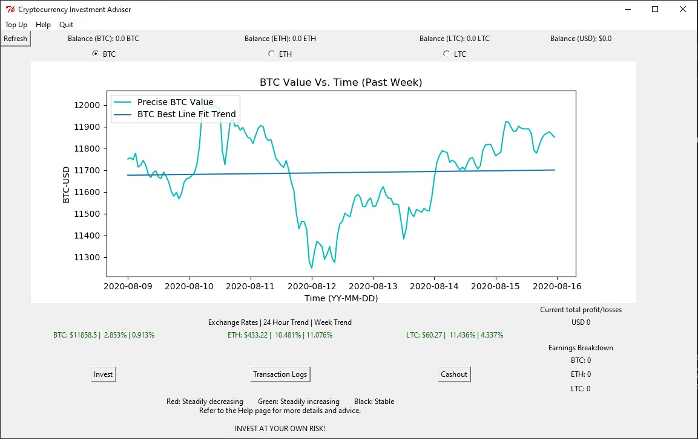

CIAdviser
---
#### A desktop based application for crypto investors when making critical investments decisions.
---
This program relies heavily on the current trends of cryptocurrencies and gives advice on whether to invest or withdraw cryptocurrencies into flat currency. The method used to measure whether the trend is going upwards or downwards is by instantaneous gradient as well as best line fit of the past 24 hours of data.

#### Usage
```
pip install -r requirements.txt
python cia1.0.1.py

```
---
#### Demo
Help page has eveything a new user would need to know about the program, it is located at the top menu bar in the Main window.


---
#### Note
Scikit-learn was not used due to the massive impact it had on user experience (loading times), and due to that, along with the volatile nature of cryptocurrencies, the scope at which the graph and data used in this program has been narrowed down to 1 week, and analysis was done using a modified version of OLS regression method.
This decision was taken with the compromise of data prediction accuracy in mind. But in the shorter term of 1 week, such difference in accuracies between the two data analysis approach are marginal compared to the impact of a painful UX.

---
#### Contribute
Feel free to contribute! You may raise an [issue](https://github.com/selmantabet/CIAdviser/issues) or provide a [pull request](https://github.com/selmantabet/CIAdviser/pulls)

 
